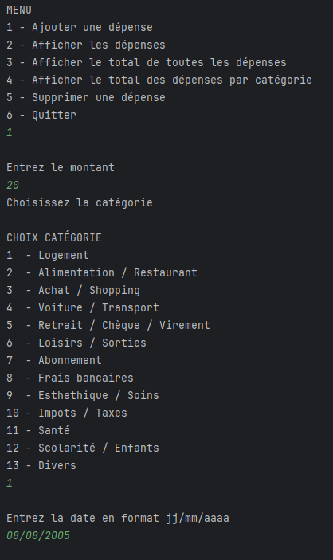
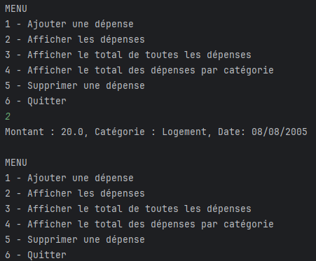
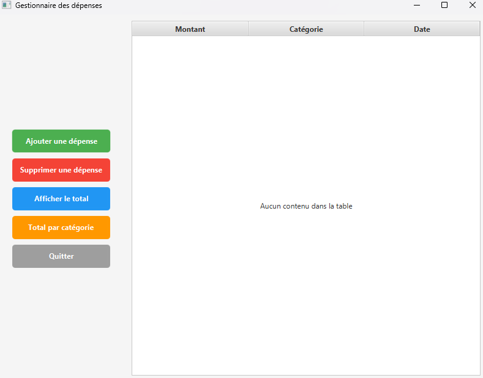
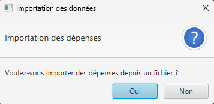
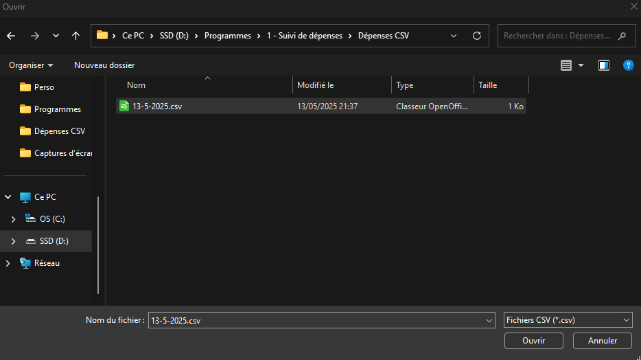
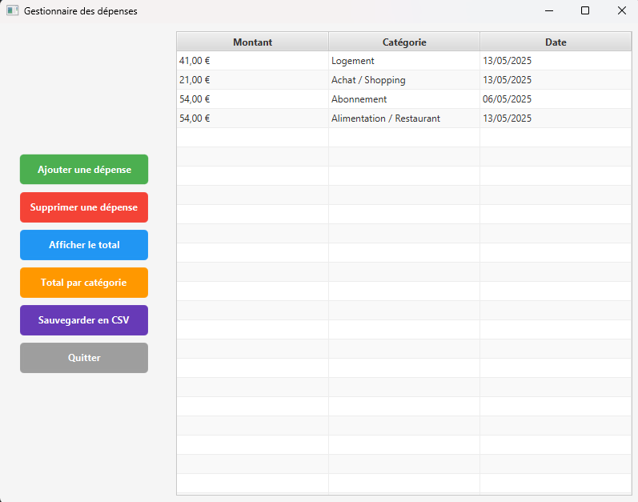
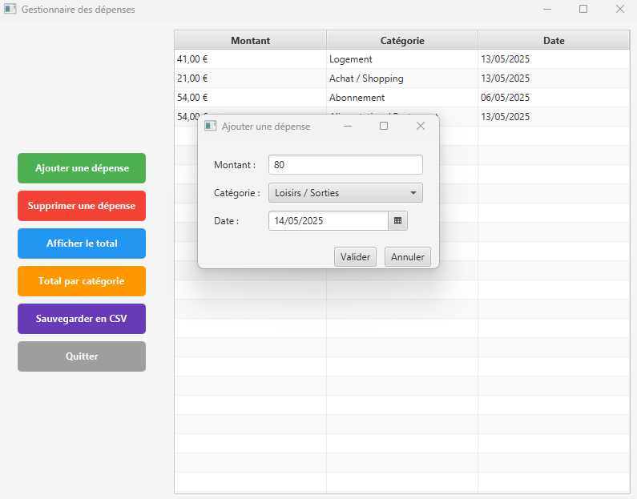
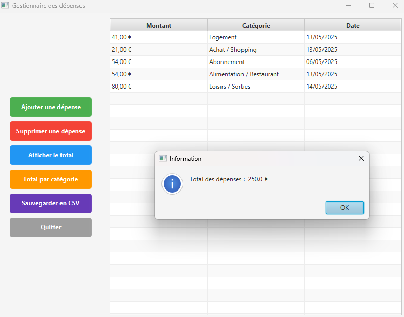

# 💸 Suivi Des Dépenses

Application mobile développée en Kotlin permettant de suivre et visualiser ses dépenses au quotidien. Idéale pour gérer un budget personnel de manière simple, ergonomique et efficace.

---

## 🖼️ Aperçu de l'application

---

### Version Terminal
#### Screen 1

#### Screen 2

#### Screen 3


---

### Version Application
#### Screen 1
  
#### Screen 2

#### Screen 3

#### Screen 4

#### Screen 5


---

## 🚀 Fonctionnalités principales

- 🧾 Ajout et modification de dépenses
- 📅 Tri par dates (jj/mm/yyyy)
- 🔍 Filtrage par catégories
- 💾 Sauvegarde locale des données

---

## 🛠️ Technologies utilisées

- **Langage :** Kotlin
- **Architecture :** MVVM
- **Build tool :** Gradle (Kotlin DSL)

---

## 📦 Installation & Lancement

1. Clonez le dépôt :
   ```bash
   git clone https://github.com/KoThek64/Suivi_Des_Depenses.git
2. Ouvrez le projet dans IntelliJ IDEA.

3. Sélectionnez le fichier GestionnaireDepensesGUIKt ou le MainKt en haut à droite de l'écran avant de lancer

4. Cliquez sur Run ▶️ pour lancer l’application, elle s'affichera soit dans le terminal si vous sélectionnez MainKt, soit dans une nouvelle fenêtre si vous avez selectionné GestionnaireDepensesGUIKt.

---

## 📁 Structure du projet

```bash
Suivi_Des_Depenses/
├── .gradle/
├── .idea/
├── .kotlin/
├── assets/
│   ├── screenshot1.png
│   └── screenshot2.png
├── build/
├── gradle/
├── src/
│   ├── main/
│   │   └── kotlin/
│   │       ├── Depense.kt
│   │       ├── GestionnaireDepenses.kt
│   │       ├── GestionnaireDepensesGUI.kt
│   │       └── Main.kt
│   └── test/
│       └── kotlin/
│           └── GestionnaireDepensesTest.kt
├── .gitignore
├── build.gradle.kts
├── gradle.properties
├── gradlew
├── gradlew.bat
├── README.me
└── settings.gradle.kts
```

---

## 🧑‍💻 Auteur

Développé par **Mattys Lachaise** dans le cadre de d'un projet personnel.

---

## 📃 Licence

Ce projet est open-source sous licence MIT. Vous pouvez l'utiliser, le modifier et le partager librement.

---