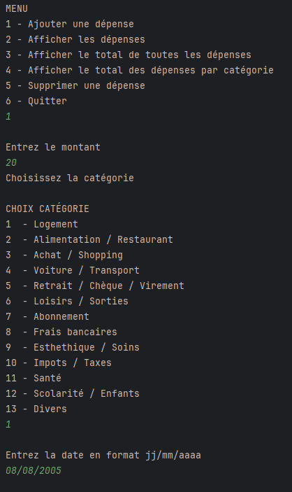
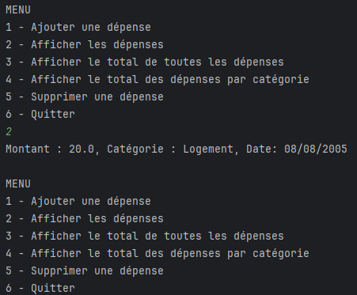
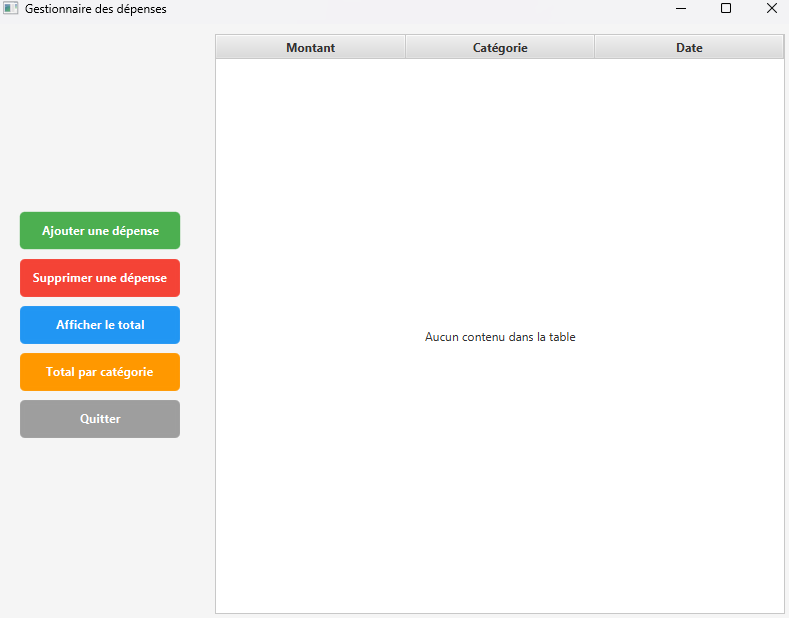
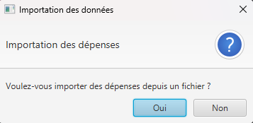
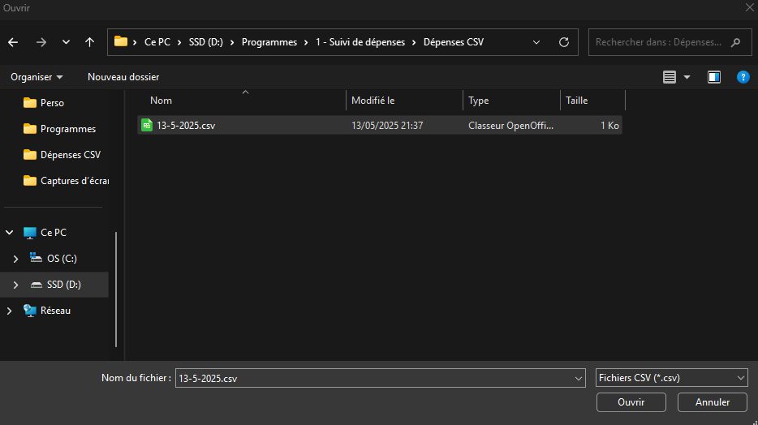
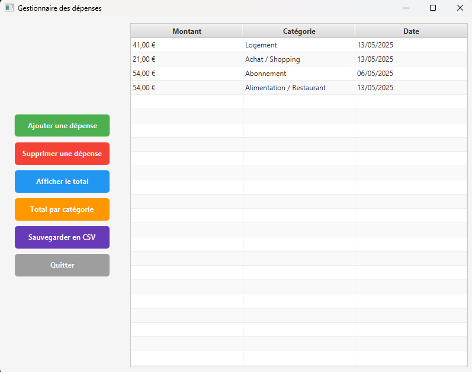
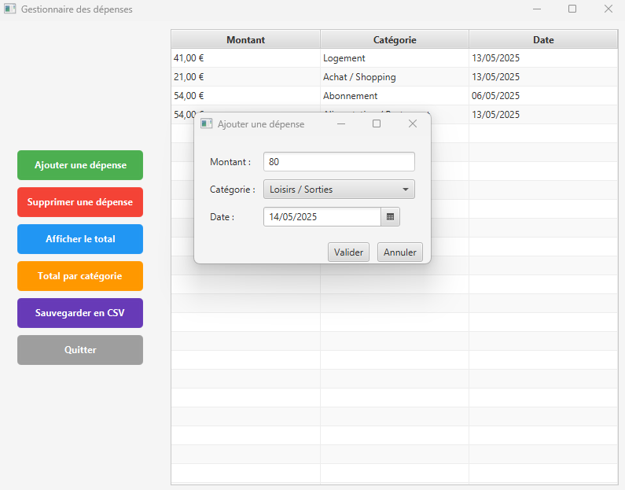
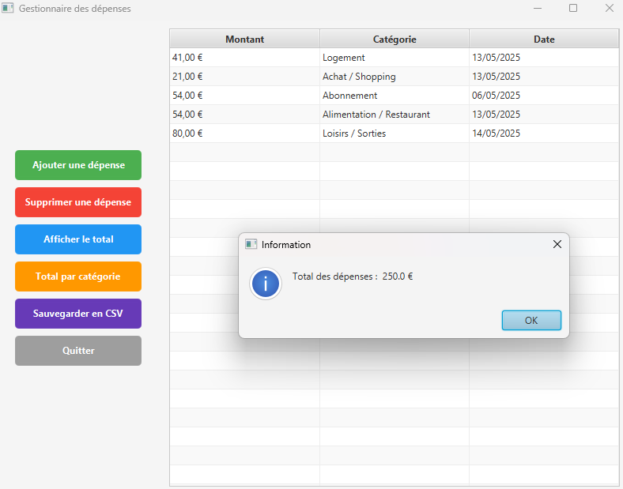

# 💸 Suivi Des Dépenses

> Application Kotlin de suivi et de visualisation de dépenses personnelles, disponible en version terminal et en version GUI JavaFX.

---

## 🚀 Fonctionnalités

- 🧾 **Ajout et suppression** de dépenses (montant, catégorie, date)
- 📅 **Tri par date** au format `jj/mm/aaaa`
- 🔍 **Filtrage et totaux** par catégorie
- 💾 **Sauvegarde locale** via fichiers CSV (import & export)
- 🖥️ **Double interface** : terminal (CLI) et fenêtre graphique (JavaFX)
- ✅ **Validation des données** : montant, date et catégorie vérifiés à la saisie

---

## 🖼️ Aperçu de l'application

### Version Terminal
| Screen 1 | Screen 2 | Screen 3 |
|----------|----------|----------|
|  |  |  |

### Version Application (JavaFX)
| Screen 1 | Screen 2 | Screen 3 |
|----------|----------|----------|
|  |  |  |

| Screen 4 | Screen 5 |
|----------|----------|
|  |  |


### 📂 Catégories disponibles

| # | Catégorie |
|---|-----------|
| 1 | Logement |
| 2 | Alimentation / Restaurant |
| 3 | Achat / Shopping |
| 4 | Voiture / Transport |
| 5 | Retrait / Chèque / Virement |
| 6 | Loisirs / Sorties |
| 7 | Abonnement |
| 8 | Frais bancaires |
| 9 | Esthétique / Soins |
| 10 | Impôts / Taxes |
| 11 | Santé |
| 12 | Scolarité / Enfants |
| 13 | Divers |

---

## 📦 Installation & Lancement

### Prérequis

- [IntelliJ IDEA](https://www.jetbrains.com/idea/) (Community ou Ultimate)
- JDK 23+

### Étapes

1. **Cloner le dépôt**
   ```bash
   git clone https://github.com/KoThek64/Suivi_Des_Depenses.git
   ```

2. **Ouvrir le projet** dans IntelliJ IDEA.

3. **Sélectionner le point d'entrée** en haut à droite avant de lancer :
   - `MainKt` → lance la **version terminal** (CLI)
   - `GestionnaireDepensesGUIKt` → lance la **version graphique** (JavaFX)

4. **Cliquer sur Run ▶️** pour démarrer l'application.

> **Note :** Gradle téléchargera automatiquement les dépendances au premier lancement.

---

## 📁 Structure du projet

```
Suivi_Des_Depenses/
├── assets/                         # Captures d'écran (screenshot1-8.png)
├── gradle/                         # Gradle wrapper
├── src/
│   └── main/
│       └── kotlin/
│           ├── Depense.kt          # Modèle de données (montant, catégorie, date)
│           ├── GestionnaireDepenses.kt     # Logique métier (ajout, suppression, filtrage, CSV)
│           ├── GestionnaireDepensesGUI.kt  # Interface graphique JavaFX
│           └── Main.kt             # Interface terminal (CLI)
├── build.gradle.kts                # Configuration Gradle (Kotlin DSL)
├── settings.gradle.kts             # Nom du projet et dépôts
├── gradle.properties               # Propriétés Gradle
├── gradlew / gradlew.bat           # Scripts Gradle wrapper
├── .gitignore
└── LICENSE
```

### Rôle des fichiers sources

| Fichier | Description |
|---------|-------------|
| `Depense.kt` | Data class représentant une dépense avec montant, catégorie et date |
| `GestionnaireDepenses.kt` | Cœur du projet : gestion des dépenses, calculs, import/export CSV |
| `Main.kt` | Interface en ligne de commande avec menu numéroté |
| `GestionnaireDepensesGUI.kt` | Interface JavaFX : tableau de bord, dialogues, boutons stylisés |

## 🛠️ Technologies utilisées

| Technologie | Version |
|-------------|---------|
| Kotlin | 2.1.10 |
| Java SDK | JDK 23 (jvmToolchain) |
| JavaFX | 24.0.1 |
| Gradle (Kotlin DSL) | 8.10 |
| Architecture | MVVM |

---

## 🧑‍💻 Auteur

Développé par **Mattys Lachaise** dans le cadre d'un projet personnel.

---

## 📃 Licence

Ce projet est distribué sous licence **MIT**. Vous êtes libre de l'utiliser, le modifier et le redistribuer.

---
